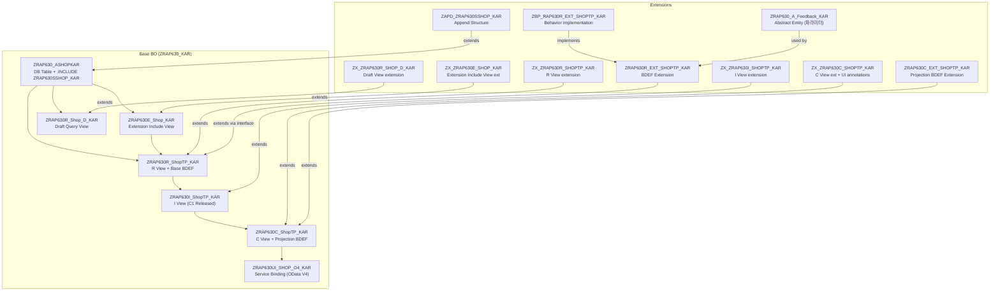

# ZRAP630_KAR 실습 노트

> RAP630 튜토리얼을 S/4HANA Public Cloud TDD 시스템에서 개인 suffix **KAR**로 진행한 실습 기록입니다.  
> 패키지: `ZRAP630_KAR` / 시스템: `my414708.s4hana.cloud.sap`

---

## 목차

1. [프로젝트 개요](#1-프로젝트-개요)
2. [RAP 아키텍처 개념 (쉽게)](#2-rap-아키텍처-개념-쉽게)
3. [Ex1 - 표준 BO 활용 (I_BankTP)](#3-ex1---표준-bo-활용-ibanktップ)
4. [Ex2 - 동작 확장 (BDEF Extension)](#4-ex2---동작-확장-bdef-extension)
5. [Ex3 - 필드 확장 (Data Model Extension)](#5-ex3---필드-확장-data-model-extension)
6. [Ex4 - Action 확장](#6-ex4---action-확장)
7. [실습 중 겪은 문제들](#7-실습-중-겪은-문제들)
8. [RAP Extension 전체 흐름 요약](#8-rap-extension-전체-흐름-요약)
9. [참고 자료](#9-참고-자료)

---

## 1. 프로젝트 개요

### 뭘 만들었나

SAP RAP(RESTful ABAP Programming Model) 기반으로 **extensible RAP BO**를 직접 만들고, 거기에 검증/자동계산/필드/액션을 Extension으로 추가하는 실습입니다.

SAP S/4HANA Public Cloud 환경에서는 표준 객체를 직접 수정할 수 없기 때문에, **Extension 패턴**으로 기능을 추가하는 방법을 익히는 게 핵심입니다.

### 실습 환경

| 항목 | 내용 |
|------|------|
| 시스템 | S/4HANA Public Cloud TDD |
| Development URL | `my414708.s4hana.cloud.sap` |
| 개발 도구 | Eclipse ADT |
| ABAP 버전 | ABAP for Cloud Development |
| 패키지 | `ZRAP630_KAR` |
| Suffix | `KAR` |

---

## 2. RAP 아키텍처 개념 (쉽게)

### RAP이 뭔가

RAP은 SAP에서 Fiori 앱을 만드는 현대적인 방법입니다.  
옛날에는 ABAP 코드로 직접 DB 조작했다면, RAP은 **"이 Entity는 이런 동작을 한다"를 선언적으로 정의**하고 프레임워크가 나머지를 처리해줍니다.

비유하자면 레스토랑 메뉴판 같은 겁니다. 메뉴판(BDEF)에 "이 요리는 주문 가능, 수정 가능, 삭제 불가"라고 정의해두면, 웨이터(RAP 프레임워크)가 알아서 처리해줍니다.

### R / I / C 레이어가 왜 나뉘는가

```
DB Table
  ↓
R_ (Restricted Base View)   ← 비즈니스 로직, DB와 직접 연결
  ↓
I_ (Interface View)         ← 외부에 공개되는 API 계층 (C1 Release)
  ↓
C_ (Projection View)        ← Fiori UI에서 실제 사용하는 뷰
  ↓
Service Definition / Binding ← OData 서비스로 노출
```

- **R_**: 실제 DB 테이블과 연결, 내부 비즈니스 로직 담당
- **I_**: 다른 팀/컴포넌트가 EML로 접근할 수 있는 안정적인 인터페이스
- **C_**: UI 화면에 맞게 커스터마이징한 뷰

### Extension이 왜 필요한가

SAP 표준 객체나 다른 팀이 만든 BO는 직접 수정할 수 없습니다.  
그래서 **원본은 건드리지 않고, 레이어를 하나 더 씌워서** 기능을 추가하는 방식이 Extension입니다.

마치 스마트폰 케이스처럼, 폰 본체(원본 BO)는 그대로 두고 케이스(Extension)만 교체하는 개념입니다.

### BDEF (Behavior Definition)가 뭔가

CDS View가 **"어떤 데이터가 있는지"** 정의한다면,  
BDEF는 **"그 데이터로 무엇을 할 수 있는지"** 정의합니다.

```abap
-- BDEF 예시
define behavior for ZRAP630R_ShopTP_KAR alias Shop
{
  create;        -- 생성 가능
  update;        -- 수정 가능
  delete;        -- 삭제 가능
  
  determination CalculateOrderID on save { create; }  -- 저장 시 ID 자동생성
}
```

---

## 3. Ex1 - 표준 BO 활용 (I_BankTP)

### 뭘 했나

SAP이 공개한 표준 BO인 `I_BankTP`(은행 마스터) 위에 **커스텀 Projection 레이어**를 씌워서 Fiori 화면을 만들었습니다. 코드 한 줄 없이 CDS View + BDEF + Service만으로 CRUD 화면 완성.

### 만든 객체 목록

| 객체 | 이름 | 역할 |
|------|------|------|
| Projection View | `ZC_BANKTPKAR` | Bank root view |
| Projection View | `ZC_BANKADDRESSTPKAR` | 은행 주소 |
| Projection View | `ZC_BANKSCRIPTEDADDRESSTPKAR` | 은행 국제주소 |
| Projection BDEF | `ZC_BANKTPKAR` | 동작 정의 |
| DCL | `ZC_BANKTPKAR` | 접근 제어 |
| Service Definition | `ZUI_BANKTP_O4KAR` | OData 서비스 정의 |
| Service Binding | `ZUI_BANKTP_O4KAR` | OData V4 바인딩 |

### 핵심 개념: EML

EML(Entity Manipulation Language)은 RAP BO를 조작하는 전용 문법입니다.

```abap
" 은행 생성 예시
MODIFY ENTITIES OF i_banktp
  ENTITY bank
  CREATE FIELDS ( bankcountry bankinternalid longbankname ... )
  WITH VALUE #( ( %cid = 'cid1'
                  BankCountry    = 'KR'
                  BankInternalID = '1234' ... ) )
  MAPPED DATA(mapped)
  REPORTED DATA(reported)
  FAILED DATA(failed).

COMMIT ENTITIES RESPONSE OF i_banktp
  FAILED DATA(failed_commit)
  REPORTED DATA(reported_commit).
```

### 핵심 개념: PRIVILEGED

`PRIVILEGED` 키워드를 붙이면 권한 체크를 건너뜁니다.  
일반 EML로 권한 없는 데이터에 접근하면 에러가 나지만, PRIVILEGED를 쓰면 통과됩니다.  
단, **내부 시스템 처리용**이지 남용하면 안 됩니다.

```abap
MODIFY ENTITIES OF i_banktp
  PRIVILEGED          " ← 권한 체크 스킵
  ENTITY bank
  CREATE FIELDS ( ... )
  ...

SELECT SINGLE * FROM I_Bank_2
  WITH PRIVILEGED ACCESS   " ← DCL 권한 체크 스킵
  WHERE BankInternalID = @bank_id
  INTO @DATA(my_bank).
```

### 💡 더 공부하면 좋은 것

- **Released API 찾는 법**: SAP API Business Hub(`api.sap.com`) 또는 ADT에서 `@API.release` 어노테이션 확인
- **C0 / C1 Release 차이**: C0은 SAP 내부용, C1은 외부 개발자도 사용 가능한 안정 API
- **DCL(Data Control Language)**: CDS View에 접근 제어를 거는 방법

---

## 4. Ex2 - 동작 확장 (BDEF Extension)

### 뭘 했나

`ZRAP630R_SHOPTP_KAR`(Shop BO)에 **원본 건드리지 않고** 3가지 동작을 추가했습니다.

1. **Validation**: 배송일 비어있으면 저장 막기
2. **Determination**: 상품 선택하면 가격/상태 자동 계산
3. **Side Effects**: 상품 바꾸면 UI 즉시 새로고침

### 만든 객체

| 객체 | 이름 | 역할 |
|------|------|------|
| BDEF Extension | `ZRAP630R_EXT_SHOPTP_KAR` | R레이어 동작 확장 |
| Projection BDEF Extension | `ZRAP630C_EXT_SHOPTP_KAR` | C레이어 action 노출 |
| Behavior Implementation | `ZBP_RAP630R_EXT_SHOPTP_KAR` | 실제 로직 구현 |

### Validation - 배송일 체크

```abap
" 배송일이 비어있으면 저장을 막는 validation
METHOD zz_validateDeliverydate.
  READ ENTITIES OF ZRAP630i_ShopTP_KAR IN LOCAL MODE
    ENTITY Shop
    FIELDS ( DeliveryDate )
    WITH CORRESPONDING #( keys )
    RESULT DATA(onlineorders).

  LOOP AT onlineorders INTO DATA(onlineorder).
    IF onlineorder-DeliveryDate IS INITIAL.
      " failed에 추가 = 저장 막음
      APPEND VALUE #( %tky = onlineorder-%tky ) TO failed-shop.
      " reported에 추가 = 에러 메시지 표시
      APPEND VALUE #( %tky    = onlineorder-%tky
                      %msg    = new_message_with_text(
                                  severity = if_abap_behv_message=>severity-error
                                  text     = 'delivery period cannot be initial' ) )
             TO reported-shop.
    ENDIF.
  ENDLOOP.
ENDMETHOD.
```

### Determination - 가격 자동 계산

```abap
" OrderedItem 변경 시 가격/상태 자동 세팅
METHOD ZZ_setOverallStatus.
  " 1. 변경된 주문 읽기
  READ ENTITIES OF ZRAP630I_ShopTP_KAR IN LOCAL MODE
    ENTITY Shop ALL FIELDS
    WITH CORRESPONDING #( keys )
    RESULT DATA(OnlineOrders).

  " 2. 상품 목록 가져오기 (하드코딩된 데모 데이터)
  DATA(products) = NEW zrap630_cl_vh_product_KAR( )->get_products( ).

  " 3. 상품별 가격 조회 후 상태 결정
  LOOP AT onlineorders INTO DATA(onlineorder).
    SELECT SINGLE * FROM @products AS hugo
      WHERE Product = @onlineorder-OrderedItem
      INTO @DATA(product).

    " 1000 EUR 초과면 승인 대기, 이하면 자동 승인
    IF product-Price > 1000.
      update_bo_line-OverallStatus = 'Awaiting approval'.
    ELSE.
      update_bo_line-OverallStatus = 'Automatically approved'.
    ENDIF.
  ENDLOOP.

  " 4. DB에 반영
  MODIFY ENTITIES OF zrap630i_shoptp_KAR IN LOCAL MODE
    ENTITY Shop
    UPDATE FIELDS ( OverallStatus CurrencyCode OrderItemPrice )
    WITH update_bo.
ENDMETHOD.
```

### Side Effects

```abap
" BDEF Extension에 선언만 하면 됨 - 코드 없이 동작
side effects { field OrderedItem affects field OrderItemPrice,
                               field CurrencyCode,
                               field OverallStatus; }
```

`OrderedItem`이 바뀌면 나머지 3개 필드를 UI가 자동으로 다시 읽어옵니다.  
Side Effects 없이는 저장해야만 반영되지만, 있으면 즉시 화면에 반영됩니다.

### 💡 더 공부하면 좋은 것

- **RAP LUW(Logical Unit of Work)**: Cloud RAP에서는 EML 외부에서 DB를 직접 수정할 수 없는 이유
- **%tky**: draft key + active key를 통합한 RAP 전용 키. draft/active 구분 없이 동일하게 처리 가능
- **IN LOCAL MODE**: 권한 체크 없이 RAP 내부에서 직접 read/modify. extension에서 필수
- **COMMIT ENTITIES vs COMMIT WORK**: RAP BO 저장은 COMMIT ENTITIES, 일반 DB는 COMMIT WORK

---

## 5. Ex3 - 필드 확장 (Data Model Extension)

### 뭘 했나

Shop BO에 **피드백(Feedback) 필드** 하나를 추가했습니다.  
단순해 보이지만 DB부터 UI까지 총 6개 객체를 수정/추가해야 합니다.

### 필드 하나 추가하는 데 왜 이렇게 많이 만드는가

RAP의 레이어 구조 때문입니다. 필드가 DB에 추가되면, 그 필드가 R→I→C 레이어를 거쳐 UI까지 올라와야 합니다. 각 레이어마다 Extension이 필요합니다.

```
DB Table (ZRAP630_ASHOPKAR)
  └─ .INCLUDE ZRAP630SSHOP_KAR       ← Extension Include Structure
       └─ ZAPD_ZRAP630SSHOP_KAR      ← [내가 만든] Append Structure (ZZFEEDBACKZAA 필드)

Draft Table (ZRAP630SH00D_KAR)
  └─ .INCLUDE ZRAP630SSHOP_KAR       ← 동일 Include (active/draft 동기화)

Extension Include View (ZRAP630E_SHOP_KAR)
  └─ ZX_ZRAP630E_SHOP_KAR            ← [내가 만든] View Extension

R_ View (ZRAP630R_SHOPTP_KAR)
  └─ ZX_ZRAP630R_SHOPTP_KAR          ← [내가 만든] View Extension

I_ View (ZRAP630I_SHOPTP_KAR)
  └─ ZX_ZRAP630I_SHOPTP_KAR          ← [내가 만든] View Extension

C_ View (ZRAP630C_SHOPTP_KAR)
  └─ ZX_ZRAP630C_SHOPTP_KAR          ← [내가 만든] View Extension + UI 어노테이션

Draft Query View (ZRAP630R_SHOP_D_KAR)
  └─ ZX_ZRAP630R_SHOP_D_KAR          ← [내가 만든] View Extension
```

### 만든 객체 목록

| 객체 | 이름 | 역할 |
|------|------|------|
| Append Structure | `ZAPD_ZRAP630SSHOP_KAR` | ZZFEEDBACKZAA 필드 실제 추가 |
| CDS View Extension | `ZX_ZRAP630E_SHOP_KAR` | Extension Include View에 노출 |
| CDS View Extension | `ZX_ZRAP630R_SHOPTP_KAR` | R뷰에 노출 (`_Extension.zz_feedback_zaa`) |
| CDS View Extension | `ZX_ZRAP630I_SHOPTP_KAR` | I뷰에 노출 |
| CDS View Extension | `ZX_ZRAP630C_SHOPTP_KAR` | C뷰에 노출 + UI 어노테이션 |
| CDS View Extension | `ZX_ZRAP630R_SHOP_D_KAR` | Draft 뷰에 노출 |

### R뷰 Extension이 특별한 이유

```abap
" R뷰는 _Extension 어소시에이션을 통해 읽어야 함
extend view entity ZRAP630R_ShopTP_KAR with
{
  _Extension.zz_feedback_zaa as ZZFEEDBACKZAA  " ← _Extension 경유
}

" I뷰, C뷰는 Shop 직접 참조
extend view entity ZRAP630I_ShopTP_KAR with
{
  Shop.ZZFEEDBACKZAA as ZZFEEDBACKZAA  " ← Shop 직접
}
```

R뷰는 `ZRAP630I_Shop_KAR`(기본 뷰)와 `ZRAP630E_Shop_KAR`(Extension Include View)를 join해서 데이터를 가져오는 구조라, Extension 필드는 `_Extension` 어소시에이션을 통해 참조해야 합니다.

### 💡 더 공부하면 좋은 것

- **Append Structure vs Include Structure 차이**: Append는 기존 테이블을 확장, Include는 구조체를 포함시키는 방식
- **extensibilityElementSuffix**: Extension 필드에 강제 suffix(여기서는 `ZAA`)를 붙이는 규칙. 충돌 방지 목적
- **active table vs draft table**: 실제 저장된 데이터(active)와 편집 중인 임시 데이터(draft)가 별도 테이블로 관리됨. 둘 다 같은 Include 구조체를 써야 데이터 일관성 유지

---

## 6. Ex4 - Action 확장

### 뭘 했나

"Update feedback" 버튼을 추가했습니다. 버튼 클릭 → 팝업에서 피드백 입력 → 저장.

### 전체 흐름

```
[Fiori UI] Update feedback 버튼 클릭
    ↓
[팝업] feedback 텍스트 입력
    ↓
[OData] ZZ_ProvideFeedback action 호출
    ↓
[BDEF Extension] action 정의 (authorization, features, parameter)
    ↓
[Behavior Impl] ZZ_ProvideFeedback 메서드 실행
    ↓
[EML] MODIFY ENTITIES → zzfeedbackzaa 업데이트
    ↓
[EML] READ ENTITIES → 업데이트된 데이터 반환
    ↓
[Fiori UI] 화면 갱신
```

### Abstract Entity - 파라미터 전달 방식

Action에 파라미터를 전달할 때는 **Abstract Entity**를 씁니다.  
일반 구조체가 아닌 CDS 객체로 만드는 이유는 RAP 프레임워크가 OData 스키마 생성 시 이를 인식해야 하기 때문입니다.

```abap
" Abstract Entity: 파라미터 정의
@EndUserText.label: 'Pass feedback as a parameter'
define abstract entity ZRAP630_A_Feedback_KAR
{
  feedback : abap.char(100);
}

" BDEF Extension에서 action 선언
action(authorization : global, features : instance) ZZ_ProvideFeedback
  parameter ZRAP630_A_Feedback_KAR
  result [1] $self;  " ← 실행 후 현재 인스턴스 반환
```

### Action 구현 코드

```abap
METHOD ZZ_ProvideFeedback.
  " 1. 파라미터로 받은 feedback 값을 zzfeedbackzaa에 저장
  MODIFY ENTITIES OF ZRAP630I_ShopTP_KAR IN LOCAL MODE
    ENTITY Shop
    UPDATE FIELDS ( zzfeedbackzaa )
    WITH VALUE #( FOR key IN keys
                  ( %tky         = key-%tky
                    zzfeedbackzaa = key-%param-feedback ) ).  " %param = 파라미터 접근

  " 2. 업데이트된 데이터를 읽어서 result로 반환 ($self 구현)
  READ ENTITIES OF ZRAP630I_ShopTP_KAR IN LOCAL MODE
    ENTITY Shop ALL FIELDS
    WITH CORRESPONDING #( keys )
    RESULT DATA(result_read).

  " 3. result 세팅 (Fiori가 화면 갱신에 사용)
  result = VALUE #( FOR order IN result_read
                    ( %tky   = order-%tky
                      %param = order ) ).
ENDMETHOD.
```

### features:instance vs authorization:global

| 구분 | 의미 | 구현 필요 메서드 |
|------|------|-----------------|
| `features : instance` | 레코드별로 버튼 활성/비활성 제어 | `get_instance_features` |
| `authorization : global` | 전체 권한 체크 | `get_global_authorizations` |

### 💡 더 공부하면 좋은 것

- **action vs function 차이**: action은 데이터를 변경할 수 있음, function은 읽기 전용
- **result `$self` vs result `[1] EntityType`**: `$self`는 현재 엔티티 자체를 반환, 별도 타입 지정도 가능
- **%param**: action 파라미터 값에 접근하는 RAP 전용 컴포넌트
- **Projection BDEF Extension**: R레이어 BDEF Extension에서 action을 정의하면, C레이어에서도 `use action`으로 노출해야 Fiori에서 사용 가능

---

## 7. 실습 중 겪은 문제들

### 문제 1: Generator TR 에러

**현상**: `ZDMO_GEN_RAP630_SINGLE` 실행 시 `Invalid transport request` 에러

**원인**: `ZRAP630_KAR` 패키지가 `Record objects changes in transport requests` 체크가 안 된 로컬 패키지라서 TR을 강제 할당할 수 없었음

**해결**: `ZDMO_GEN_RAP630_SINGLE_KAR` 클래스를 별도로 만들어 TR을 빈값으로 처리

```abap
CLASS zdmo_gen_rap630_single_kar IMPLEMENTATION.
  METHOD if_oo_adt_classrun~main.
    DATA(lo_gen) = NEW zdmo_gen_rap630_single( i_unique_suffix = 'KAR' ).
    lo_gen->if_oo_adt_classrun~main( out ).
  ENDMETHOD.
ENDCLASS.
```

---

### 문제 2: instance_feature 누락 에러

**현상**: Fiori 화면 열 때 `Handler not implemented; Method: INSTANCE_FEATURE` 에러

**원인**: BDEF Extension에 `features : instance`를 선언했지만 구현 메서드가 없었음

**해결**: Local Types에 `get_instance_features` 메서드 추가

```abap
METHODS get_instance_features FOR INSTANCE FEATURES
  IMPORTING keys REQUEST requested_features FOR Shop RESULT result.

METHOD get_instance_features.
  result = VALUE #( FOR key IN keys
                    ( %tky                       = key-%tky
                      %action-ZZ_ProvideFeedback = if_abap_behv=>fc-o-enabled ) ).
ENDMETHOD.
```

---

### 문제 3: CDS Extension 필드 참조 오류

**현상**: `ZX_ZRAP630R_SHOPTP_KAR` 활성화 실패

**원인**: `extend view entity` 뒤에 Extension 오브젝트명을 썼음 (base view 이름이 들어가야 함)

**해결**:
```abap
" 틀린 것
extend view entity ZX_ZRAP630R_SHOPTP_KAR with { ... }

" 맞는 것
extend view entity ZRAP630R_SHOPTP_KAR with { ... }
```

---

### 문제 4: Action result LIMIT 0 에러

**현상**: `Update feedback` 실행 시 `CX_SADL_CONTRACT_VIOLATION: LIMIT 0` 에러

**원인**: Action 메서드에서 `$self` result 반환 로직(READ ENTITIES 후 result 세팅)이 누락되었음

**해결**: 튜토리얼 코드대로 READ ENTITIES + result 세팅 추가

---

## 8. RAP Extension 전체 흐름 요약

### 한눈에 보는 객체 관계도



### Extension 종류별 정리

| Extension 종류 | 목적 | 예시 |
|---------------|------|------|
| Append Structure | DB 테이블에 필드 추가 | `ZAPD_ZRAP630SSHOP_KAR` |
| CDS View Extension | 뷰에 필드 노출 | `ZX_ZRAP630R_SHOPTP_KAR` |
| BDEF Extension | 동작 추가 (validation/determination/action) | `ZRAP630R_EXT_SHOPTP_KAR` |
| Projection BDEF Extension | C레이어에 action 노출 | `ZRAP630C_EXT_SHOPTP_KAR` |

### 실무에서 언제 쓰는가

- **SAP 표준 BO 확장**: SAP이 제공하는 `I_PurchaseOrderTP`, `I_SalesOrderTP` 등을 건드리지 않고 커스텀 필드/로직 추가
- **다른 팀 BO 확장**: 팀 간 코드 소유권이 분리된 환경에서 Extension으로 기능 추가
- **Clean Core 준수**: S/4HANA Cloud에서 표준 코드를 수정하지 않고 업그레이드 안전성 유지

---

## 9. 참고 자료

| 자료 | 링크 |
|------|------|
| RAP630 GitHub | https://github.com/SAP-samples/abap-platform-rap630 |
| SAP Help - RAP Extensions | https://help.sap.com/docs/abap-cloud/abap-rap/develop-rap-extensions |
| SAP Help - BDEF Extension | https://help.sap.com/doc/abapdocu_cp_index_htm/CLOUD/en-US/abenbdl_extension.html |
| SAP API Business Hub | https://api.sap.com |
| ABAP Keyword Docs (Cloud) | https://help.sap.com/doc/abapdocu_cp_index_htm/CLOUD/en-US/index.htm |

---

> 📝 **작성**: RAP630 튜토리얼 실습 기록 | suffix: KAR | S/4HANA Public Cloud TDD
